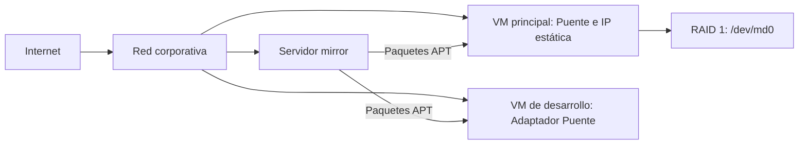

# Desafío: Optimización de la Infraestructura de Red para InnovaCloud Solutions

**Autor:** Rodrigo Trujillo

**Rol:** Líder e integrador del proyecto

Este repositorio presenta una propuesta técnica para mejorar la continuidad del almacenamiento, la gestión de paquetes, la conectividad de las máquinas virtuales y el diagnóstico de red de InnovaCloud Solutions. La solución se fundamenta principalmente en los contenidos de las semanas 5, 6 y 7 de ASI104 y responde al caso de estudio planteado en la semana 8.

Nombre del repositorio: `Desafio_RodrigoTrujillo_02`

## Datos académicos

- Universidad Don Bosco
- Facultad de Ingeniería
- Escuela de Computación
- Ciclo 02/2026
- Materia: Administración e Implementación de Servicios de Red con Sistemas Operativos Libres
- Código: ASI104 G03T
- Docente: Mtra. Ingrid Rubenia Vela Recinos

## Firma consultora

Nombre del equipo: `RodrigoTrujillo`

## Integrantes

| Integrante | Rol | Sección |
|---|---|---|
| Rodrigo Trujillo | Líder y autor del proyecto | README.md, storage.md, packages.md, networking.md y diagnostics.md |

## Cliente

InnovaCloud Solutions

## Problemática

1. El servidor principal presenta fallos de disco y no dispone de redundancia.
2. El software se instala manualmente, lo que genera inconsistencias de versiones y descargas repetidas.
3. Las máquinas virtuales utilizan NAT por defecto, lo que limita su visibilidad y comunicación directa con recursos de la red corporativa.
4. No existe un procedimiento común para revisar interfaces, direccionamiento, rutas y conectividad.

## Solución integral propuesta

| Área | Problema | Propuesta |
|---|---|---|
| Almacenamiento | Fallos de disco | RAID 1 administrado con `mdadm` |
| Software | Instalación manual | Repositorio mirror interno y APT |
| Red | NAT limita la comunicación | Adaptador Puente e IP estática mediante Netplan |
| Diagnóstico | Falta de procedimiento | Procedimiento Linux estandarizado |

Las cuatro medidas se complementan: RAID 1 mantiene una copia espejo ante la falla de una unidad; el mirror centraliza la descarga de paquetes; el Adaptador Puente integra las máquinas virtuales a la red corporativa; y el procedimiento de diagnóstico permite localizar fallas desde la interfaz local hasta el destino remoto.

## Documentación

- [Solución de almacenamiento](./storage.md)
- [Gestión de paquetes](./packages.md)
- [Configuración de red](./networking.md)
- [Diagnóstico de red](./diagnostics.md)

## Arquitectura propuesta

El diagrama representa la solución propuesta; no confirma que estos componentes ya se encuentren implementados.

## Referencias y uso de herramientas

La propuesta se elaboró principalmente con base en las presentaciones oficiales de las semanas 5, 6, 7 y 8 de la materia ASI104. Estos materiales se consultaron localmente y no se incorporaron al repositorio.

Se utilizó inteligencia artificial (IA) como herramienta de apoyo para estructurar el diagrama Mermaid y presentar ejemplos visuales dentro de los archivos Markdown. El contenido técnico, las decisiones propuestas y la redacción final fueron revisados y adaptados por Rodrigo Trujillo conforme a los materiales de clase y al caso de estudio.

## Defensa

Repositorio:  
https://github.com/Truja503/Desafio_RodrigoTrujillo_02

Video:  
`[AGREGAR URL DEL VIDEO]`

## Consideraciones

- Los comandos deben adaptarse a los nombres reales de interfaces y discos antes de ejecutarse.
- Las direcciones de red utilizadas son ejemplos académicos y deben sustituirse según la infraestructura real de InnovaCloud Solutions.
- `<SERVIDOR_MIRROR>` es un marcador y debe reemplazarse por la dirección IP o el nombre DNS real del mirror.
- RAID proporciona redundancia, pero no sustituye una estrategia de copias de seguridad.
- Las configuraciones descritas son propuestas para un escenario de implementación; no se afirma que hayan sido aplicadas físicamente.
